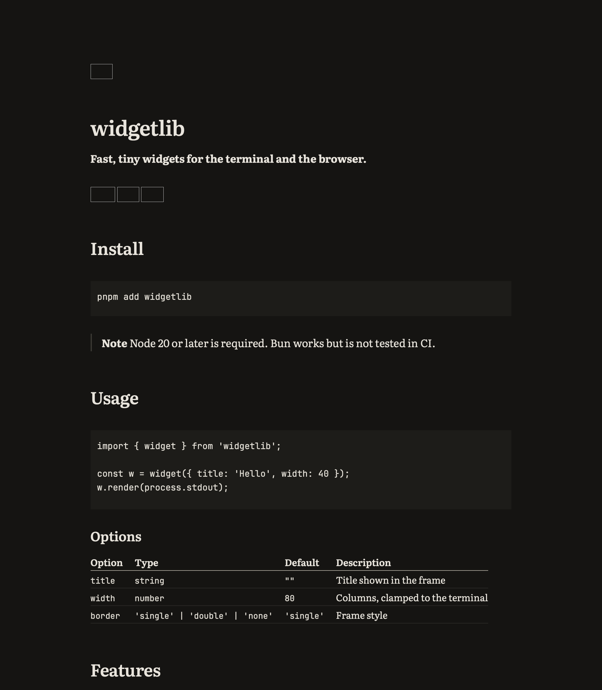

# Marxy

**A markdown reader.** Free and open source, quiet, fast, and set like a book.

Everything in Marxy follows from reading being the point. Documents open instantly, an index
lets you flip between them without losing your place, and text is set with Knuth–Plass line
breaking that Marxy performs itself. Code and AI artifacts are first-class content, and
operations let you act on what you read — copy a section, toggle a task item, align a table — as
pure transformations that touch only the bytes in range.



## What makes it different

Four promises. They are enforced by gates in CI, not aspired to in a roadmap.

| Promise | How it is held |
| --- | --- |
| **Never touches a byte you did not ask it to change** | every edit is a pure `string → string` transformation spliced into one buffer; a property test over the corpus fails on any other byte moving |
| **No telemetry. Nothing phones home** | a no-network gate renders every corpus document in two engines and asserts nothing reaches off the machine |
| **Themes cannot make network requests** | themes are declarative documents, not code; remote images stay blocked until you allow them for a document |
| **MIT, the whole tree, forever** | a licence audit resolves every npm package and every linked Rust crate and fails on copyleft or on anything it cannot determine |

No accounts, no paid tier, no plugin API, no tab bar, no reading-time estimates. `docs/adr/`
records why each of those is a boundary rather than a backlog item.

## Status

**Pre-v1 and not yet released.** There are no tags and no downloadable builds; the way to run it
today is to build from source. The reader works — parsing, typesetting, the palette, themes and
the index are in — and the remaining phases are in [`docs/plan.md`](docs/plan.md).

## Build from source

Toolchain versions come from `mise.toml`; there is no other machine-specific setup.

```bash
mise install && pnpm install && pnpm build
```

Then `pnpm --filter @marxy/desktop dev` for the app, or `pnpm --filter @marxy/desktop bundle` to
produce a platform bundle. Linux additionally needs the WebKitGTK development packages
(`libwebkit2gtk-4.1-dev`, `libgtk-3-dev`, `libayatana-appindicator3-dev`, `librsvg2-dev`).

## Repository layout

```
apps/desktop        the desktop shell (Tauri) and app UI
packages/core       parse → AST with byte provenance, sanitise, outline, operations, index
packages/typeset    Knuth–Plass, hanging punctuation, baseline grid
packages/theme      default theme and the --marxy-* contract
packages/shell-api  the privileged-operation interface
fixtures/corpus     the documents every gate runs on
scripts/            the gates
docs/               brief, design language, ADRs, plan, scope
```

One buffer is truth, one parse produces one AST in which every node carries byte provenance, and
everything privileged goes through `packages/shell-api` so the shell is replaceable.

## Documentation

| If you want | Read |
| --- | --- |
| to work on Marxy, human or agent | [`AGENTS.md`](AGENTS.md) — read first, every session |
| to not get a red pull request | [`docs/ci-contract.md`](docs/ci-contract.md) |
| the product, distilled | [`docs/brief.md`](docs/brief.md) |
| why the app looks the way it does | [`docs/design-language.md`](docs/design-language.md) |
| why a decision is the way it is | [`docs/adr/`](docs/adr/) |
| what v1 is and is not | [`docs/scope.md`](docs/scope.md) |
| how work actually ships here | [`docs/sdlc.md`](docs/sdlc.md) |

## Contributing

See [`CONTRIBUTING.md`](CONTRIBUTING.md). **Inbound = outbound:** opening a pull request licenses
your contribution under MIT. There is no CLA and there will not be one — a CLA exists to enable a
later proprietary relicence, which this project has refused (ADR-0006).

Work is tracked in Jira project MARXY, mirrored in `docs/plan/jira-issues.csv`. One issue, one
branch, one pull request, squash-merged. Commits and pull requests follow
[`docs/conventions.md`](docs/conventions.md), and commitlint checks them in CI.

## Licence

MIT (see [`LICENSE`](LICENSE)). The bundled typefaces — Literata, Source Serif 4, IBM Plex Mono
and JetBrains Mono — are SIL OFL 1.1, each isolated in `fonts/<family>/` with its licence
verbatim; the KaTeX fonts arrive with the `katex` package under the same licence. Font files are
never modified (Reserved Font Name). Third-party notices are generated into
[`THIRD_PARTY_NOTICES.md`](THIRD_PARTY_NOTICES.md).
