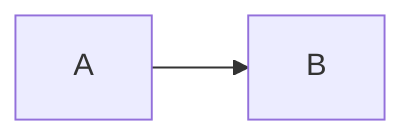

# Alerts fixture

> [!NOTE]
> A note for readers.

> [!TIP]
> A tip.

> [!IMPORTANT]
> Important text.

> [!WARNING]
> Warning text.

> [!CAUTION]
> Caution text.

> [!NOTE] Custom headline
> Titled alert.

> **Note**
> Legacy callout.

