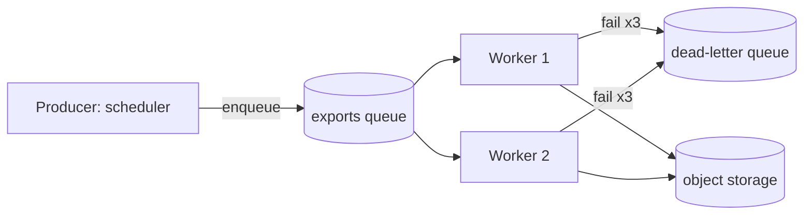

Sure! Here's a complete migration plan for moving `invoice-export` off the cron host and onto a queue-backed worker. I've kept it practical, so you can paste it straight into your runbook.

# 🚀 Migrating `invoice-export` from Cron to a Queue Worker

Today the service runs as a nightly cron job on a single VM (`batch-01.example.invalid`). The goal is a containerized worker that pulls jobs from a queue, so a failed export can be retried without anyone logging in to a box. Here's the plan, step by step.

## Overview

The migration has three moving parts: the *producer* (what used to be the crontab line), the *queue*, and the *worker* (the old script, wrapped). You'll run both systems side by side for two weeks. The old path stays authoritative until the new one has matched it for ten consecutive nights.

- **Step 1:** Inventory what the cron job really does (it usually does more than the script name suggests).
- **Step 2:** Wrap the export in an idempotent handler.
- **Step 3:** Stand up the queue and a dead-letter queue.
- **Step 4:** Run both paths in shadow mode and compare outputs.
- **Step 5:** Cut over, then retire the crontab entry.

Things to decide before you start:

• Who owns the dead-letter queue once the migration is done
• Whether exports must stay ordered per customer
– What the retention period is for finished jobs
– Whether the old host's `/var/exports` directory is part of any audit trail
• Which team gets paged when the queue depth alarm fires

## Step 1: Inventory the cron job

Run this on the old host and keep the output; you will diff against it later.

```bash
crontab -l | grep invoice-export
ls -la /opt/invoice-export/
grep -R "sendmail\|curl" /opt/invoice-export/*.sh
```

Then write down every side effect. In my experience the list looks something like this:

1. Reads unexported invoices from the `invoices` table
2. Writes one CSV per customer to `/var/exports`
3. Emails the finance mailbox when it finishes
1. Deletes CSV files older than 30 days
1. Touches a heartbeat file that the monitoring agent watches

The last three items are the ones people forget. Treat each of them as its own requirement. Here is the order I would work in; I have let the numbering take care of itself:

1. Write the handler
1. Write the tests
1. Write the deploy manifest

## Step 2: Make the handler idempotent

A queue will deliver a job more than once eventually, so the handler must be safe to run twice for the same `(customer_id, period)`. The simplest way is to derive the output filename from the job and write atomically.

```python
def export_invoices(job: dict) -> str:
    customer = job["customer_id"]
    period = job["period"]          # e.g. "2026-09"
    final = f"/var/exports/{customer}-{period}.csv"
    tmp = final + ".part"
    rows = fetch_unexported(customer, period)
    with open(tmp, "w", newline="") as fh:
        write_csv(fh, rows)
    os.replace(tmp, final)          # atomic on the same filesystem
    return final
```

Once that works locally, do the following:

4. Add a unit test that calls the handler twice and asserts the file is byte-identical.
5. Add a test where the database raises halfway through and no `.part` file is left behind.

1. Wire the handler into the worker entry point.
2. Add structured logging with the job id.
3. Expose `/healthz` on port 8080.

## Step 3: Stand up the queue

Here is the topology I would use. Keep it boring.



And the queue settings:

```json
{
  "queue": "invoice-export",
  "visibilityTimeoutSeconds": 900,
  "maxReceiveCount": 3,
  "deadLetterQueue": "invoice-export-dlq",
  "retentionDays": 14,
}
```

Notes on the options:

- **Visibility timeout:** must be longer than your slowest export. Ours peaks near 11 minutes, so 900 seconds is comfortable.
   - Too short and two workers will pick up the same job.
   * Too long and a crashed worker holds a job hostage.
   - Measure first, then add a 30% margin.
- **Max receive count:** three attempts is a reasonable default.
   * Anything that fails three times is almost never transient.
- **Retention:** match whatever finance needs for audit, not what is convenient.

### Sizing

Roughly, here's what to expect. Please treat these as starting points and not promises:

| Customers | Avg rows | Workers | Expected wall time |
|---|---|---|---|
| 200 | 1,200 | 1 | ~9 min |
| 1,000 | 1,300 | 2 |
|  5,000   | 1,250  |  4  |  ~55 min  | extra |
| 20,000 | 1,400 | 8 | ~2 h 10 min |

## Step 4: Shadow mode

For two weeks, let the cron job keep writing to `/var/exports` and have the worker write to a different prefix. Then compare:

```bash
diff -rq /var/exports/ /mnt/shadow/exports/ | tee shadow-diff.txt
wc -l shadow-diff.txt
```

A clean night means the diff is empty. Anything else is a bug in one of the two paths — usually the worker, but not always. One thing I've seen: the old script rounded to two decimals with "banker's rounding", while the new code uses “round half up”. Another: the old CSVs had CRLF line endings -- the finance team's importer silently depended on them.

Here's a template you can drop into the migration ticket:

`````markdown
# Migration ticket: invoice-export

## Summary

Move the nightly export from cron to the queue worker.

## Acceptance

- Ten consecutive clean shadow nights
- Dead-letter queue empty at cutover
- Runbook updated

## Rollback

Re-enable the crontab entry. The exact line is below.

````text
17 2 * * * /opt/invoice-export/run.sh >> /var/log/invoice-export.log 2>&1

To restore it:

```sh
crontab -e
```
````

## Owner

Platform team
`````

## Step 5: Cut over

1. Disable the producer's shadow flag.
2. Watch the first real night end to end.

```sh
kubectl logs -l app=invoice-export --since=1h | tail -n 50
```

1. Confirm the heartbeat, the email, and the cleanup job all still happen.
2. Remove the crontab entry.

Don't remove the old host for another month.

## Step 6: Monitoring and alerts

A queue-backed worker fails differently from a cron job. The cron job failed loudly, at 02:17, by email. The worker fails quietly, by getting slower. Add these before cutover, not after:

- **Queue depth:** alert when the oldest message is more than 30 minutes old, not when the count is high. A long queue that is draining is fine.
- **Dead-letter depth:** alert on any message at all. The dead-letter queue should be empty on a healthy night.
- **Heartbeat:** keep writing the old heartbeat file for as long as the monitoring agent reads it, even though nothing else needs it.
- **Duration:** record the wall time per job and chart the 95th percentile, so a slow trend shows up weeks before a timeout does.

A minimal alert definition looks like this:

```yaml
alerts:
  - name: invoice-export-oldest-message
    expr: queue_oldest_message_age_seconds{queue="invoice-export"} > 1800
    for: 10m
    severity: page
  - name: invoice-export-dlq-not-empty
    expr: queue_depth{queue="invoice-export-dlq"} > 0
    for: 1m
    severity: ticket
```

### What to do when the dead-letter queue fills

1. Look at the oldest message and read its error, not the newest.
2. Decide whether it is a data problem or a code problem.
3. For a data problem, fix the row and re-drive the message.
4. For a code problem, fix the handler, deploy, and then re-drive everything.

Please don't purge the dead-letter queue to make the alarm go quiet. Those messages are the only record of what failed.

## Risks I would flag to your manager

| Risk | Likelihood | Mitigation |
|:--|:-:|--:|
| A hidden side effect of the cron script is missed | Medium | Step 1 inventory, shadow mode |
| Two workers export the same customer at once | Low | Idempotent filenames, atomic rename |
| The queue service has an outage on cutover night | Low | Keep the crontab line commented, not deleted |
| Finance's importer depends on CRLF endings | High | Diff byte for byte, not line for line |

## Pitfalls

Some things that tend to go wrong:

Line one of a note ends with two spaces.  
Line two follows without a blank line, so it should be a hard break.<br>This one follows an HTML break tag, which should survive as a break.

Fish &amp; chips is not a joke here: an unescaped ampersand in the customer name column broke a CSV importer once. Also watch for non&nbsp;breaking spaces pasted in from a spreadsheet, which look like spaces and are not.

Quotes are another trap. Chat tools tend to emit "straight quotes" and ‘curly ones’ in the same answer, along with an em-dash — like this one — next to a double hyphen -- like this one. Normalise before you diff.

The next paragraph is followed directly by a rule with no blank line between them, which is a classic way to turn a sentence into a heading by accident
---

Here is a deliberate thematic break after a blank line:

***

#migration #runbook #queues

That last line is a hashtag the assistant added for a tracker. It has no space after the `#`, so it is just text.

## Sources

- https://docs.example.invalid/queues/visibility-timeout
- https://blog.example.invalid/2026/idempotent-exports
- https://wiki.example.invalid/platform/runbooks/cron-retirement

Let me know if you'd like me to turn this into a checklist, draft the dead-letter queue alarm, or write the shadow-mode comparison script.
